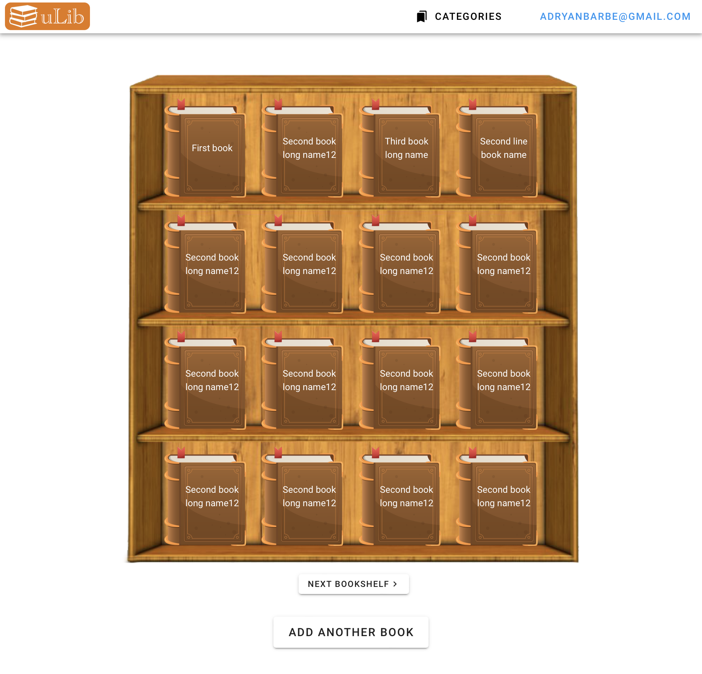
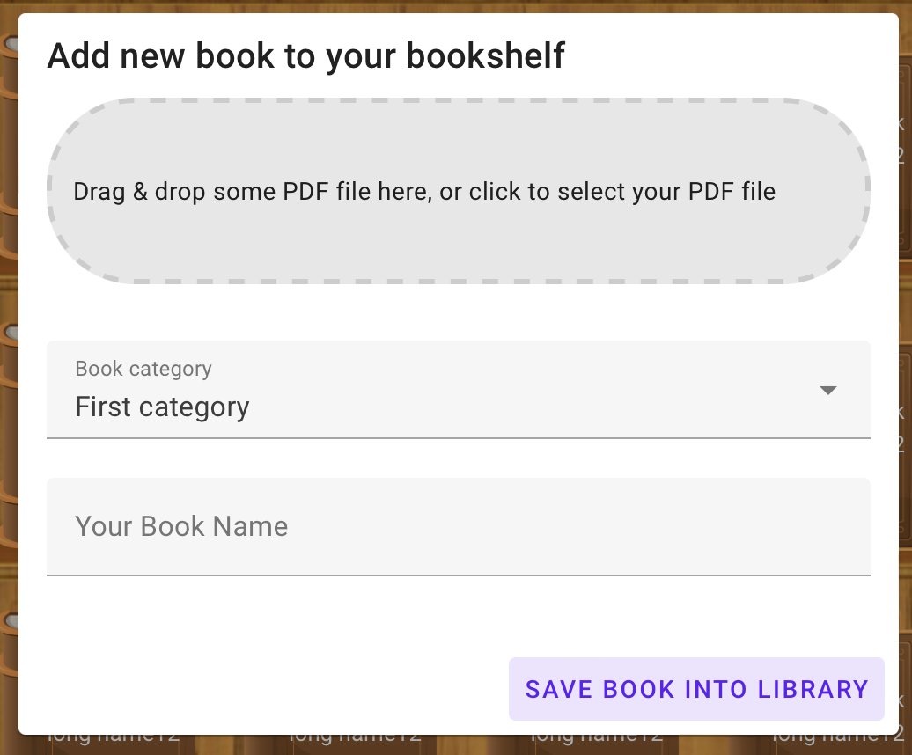
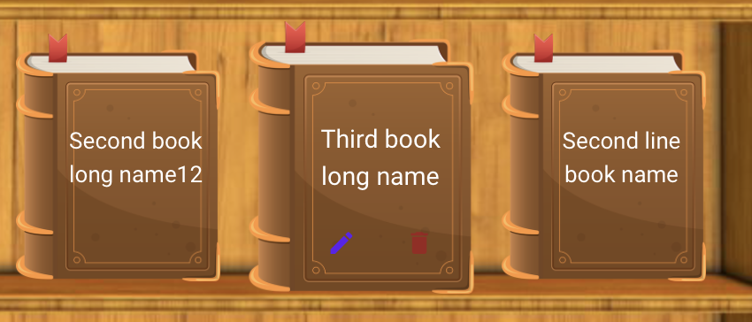

<a name="readme-top"></a>

[![MIT License][license-shield]][license-url]
[![LinkedIn][linkedin-shield]][linkedin-url]


<!-- PROJECT LOGO -->
<br />
<div align="center">
  <a href="https://github.com/othneildrew/Best-README-Template">
    
  </a>

  <h3 align="center">uLib App – your e-library</h3>

  <p align="center">
    An awesome software tool for keeping your own books and reading in one place and accessable!
    <br />
    <a href="https://github.com/adrianbarbe/RemoteFinder/blob/main/README.md"><strong>Explore the docs »</strong></a>
    <br />
    <br />
    <a href="https://ulib.online"><strong>View Demo</strong></a>
    ·
    <a href="https://github.com/adrianbarbe/RemoteFinder/issues">Report Bug</a>
    ·
    <a href="https://github.com/adrianbarbe/RemoteFinder/issues">Request Feature</a>
  </p>
</div>


<!-- TABLE OF CONTENTS -->
<details>
  <summary>Table of Contents</summary>
  <ol>
    <li>
      <a href="#about-the-project">About The Project</a>
      <ul>
        <li><a href="#built-with">Built With</a></li>
      </ul>
    </li>
    <li>
      <a href="#getting-started">Getting Started</a>
      <ul>
        <li><a href="#prerequisites">Prerequisites</a></li>
        <li><a href="#installation">Installation</a></li>
      </ul>
    </li>
    <li><a href="#usage">Usage</a></li>
    <li><a href="#roadmap">Roadmap</a></li>
    <li><a href="#contributing">Contributing</a></li>
    <li><a href="#license">License</a></li>
    <li><a href="#contact">Contact</a></li>
    <li><a href="#acknowledgments">Acknowledgments</a></li>
  </ol>
</details>


<!-- ABOUT THE PROJECT -->
## About The Project
This is a piece of software which you could use to store your books and to make them available from multiple devices. It uses Google oAuth2 authentication
which makes it even easier to use.



<p align="right">(<a href="#readme-top">back to top</a>)</p>


### Built With

* [![.NET][.NET]][.NET-url]
* [![Vue][Vue.js]][Vue-url]
* [![PostgreSQL][psql]][psql-url]


<p align="right">(<a href="#readme-top">back to top</a>)</p>

## Project design

This project is build as a Client-API application with a client developed using the VueJs 3 front-end framework and API developed by using .NET 6 C#.
We used Entity Framework as main ORM and the chosen approach was Code First. This choice is dictated by the usability and maintainability of this approach. It creates uniform namings across the DB, there's no need to write down SQL code and maintain SQL code base.

The project is a solution that consists of 5 .NEt projects that corresponds to the architectural layers.

For this project we have chosen 3-tier / Layer architecure. It comprise of 3-tiers, Presentation Layer, Business Logic Layer, and Data Access Layer. Each Layer will have its own namespace, assembly and project (classes and folders)in the solution. 

We considered this architecture becuase there are some benefits of N-tier Architecture:
* Reuse of the code
* Improve of the Maintainability
* Looser Coupling

In our project we have next projects:
* RemoteFinder.DAL - Data access layer, where the entity configurations, migrations and EF Context is saved.
* RemoteFinder.Entities – a class project where the Entities are grouped. They are suffixed by "*Entity"
* RemoteFinder.Models - a class project where the Data Transfer Objects (DTO) are located
* RemoteFinder.BLL - Business logic layer, a class project where the services and other business logic (authentication, 3rd party API integration, validation) is stored.
* RemoteFinder.Web – API project, presentation layer. A set of Controllers with exposed API endpoints, where the routing, authentication guards are implemented.

## Implementation

Some notable libraries (NuGets) used in our application are:
* AWSSDK.S3 – for integration with AWS S3 compatible data storage service like MinIO
* FluentValidation – for DTO validation
* RestSharp - for sending API requests during the validation of oAuth2 code
* Serilog and Serilog.Sinks.Console and Serilog.Sinks.Telegram – for collecting and sending logs to console, and warnings and up – to Telegram.
* JWt - for generating user-facing JWT

#### Business layer

Business layer contains logic for Authentication, Custom Exceptions, Extension methods, Helpers, Mappes (between Entities and DTOs and vice-versa) and the most important – Services. 

Validators are crated based on FluentValidation. 

Among services, there are CRUD Services for Books, Category, File and UserSocial. UserSocial is an entity used for storing oAuth2 users.
There is also AwsMinioClient service that is used for uploading files to MinIO

Some notable places in BLL are:
* use of ```IHttpContextAccessor``` in BLL for getting the current user.
```c#
var subValue = _httpContextAccessor.HttpContext.User.FindFirst(JwtRegisteredClaimNames.Sub)?.Value;

            bool parseRes = int.TryParse(subValue, out var userId);

            if (!parseRes)
            {
                Log.ForContext<AuthorizationService>().Error("Cannot parse user Id from {SubValue}", subValue);
                
                throw new ValidationException("User id is not an integer");
            }

            return userId;
        }
```

* upload to AWS S3 compatible storage file logic 
```c#
var fileExtension = Path.GetExtension(fileNameWithExt);
            var fileMimeType = MimeTypes.GetMimeType(fileExtension);
            var fileNameWithoutExt = fileNameWithExt.Replace(fileExtension, string.Empty);

            var fileNameWithoutExtTranslited = TransliterationHelper.Transliterate(fileNameWithoutExt.RemoveWhitespace());

            var uniqueFilename = $"{GetCurrentUnixTimeStamp()}__{fileNameWithoutExtTranslited.ToLower()}{fileExtension}";

            try
            {
                if (!await AmazonS3Util.DoesS3BucketExistV2Async(_client, bucketName))
                {
                    var bucket = await _client.PutBucketAsync(bucketName);

                    if (bucket.HttpStatusCode != HttpStatusCode.OK)
                    {
                        throw new UploadFileException("Error when creating bucket");
                    }
                }

                var request = new PutObjectRequest
                {
                    BucketName = bucketName,
                    Key = uniqueFilename,
                    ContentType = fileMimeType,
                    InputStream = fileToUpload,
                    CannedACL = S3CannedACL.AuthenticatedRead
                };

                var cancellationToken = new CancellationToken();

                var response = await _client.PutObjectAsync(request, cancellationToken);

                if (response.HttpStatusCode != HttpStatusCode.OK)
                {
                    throw new UploadFileException("Error when uploading file");
                }
            }
```

* pagination for the books
```c#
        var currentUserId = _authorizationService.GetCurrentUserId();
        
        var skip = (query.PageNumber - 1) * query.ItemsPerPage;

        var itemsQuery = _mainContext.Book
            .Where(b => b.UserSocialId == currentUserId)
            .OrderBy(b => b.Id)
            .AsQueryable();
        
        var totalCount = itemsQuery.Count();
        
            var items = itemsQuery
            .Include(b => b.File)
            .Include(b => b.Category)
            .Skip(skip)
            .Take(query.ItemsPerPage)
            .Select(b => _mapperBook.Map(b))
            .ToList();

        return new DataGridModel<BookBase>
        {
            Total = totalCount,
            Items = items,
        };
```

* JWT generation

```c#
var jwtSecretKey = Environment.GetEnvironmentVariable("JwtSecretKey") ?? _jwtSettings.SecretKey;

        var tokenBuilder = new JwtBuilder()
            .WithAlgorithm(new HMACSHA256Algorithm())
            .WithSecret(jwtSecretKey)
            .AddClaim(JwtRegisteredClaimNames.Exp,
                DateTimeOffset.UtcNow.AddMinutes(_jwtSettings.ExpirationMinutes).ToUnixTimeSeconds())
            .AddClaim(JwtRegisteredClaimNames.Iss, _jwtSettings.Issuer)
            .AddClaim(JwtRegisteredClaimNames.Aud, _jwtSettings.Audience)
            .AddClaim(JwtRegisteredClaimNames.Sub, userEntity.Id)
            .AddClaim(JwtRegisteredClaimNames.UniqueName, userEntity.Username)
            .AddClaim(JwtRegisteredClaimNames.Email, userEntity.Email)
            .AddClaim(JwtRegisteredClaimNames.Iat, DateTimeOffset.UtcNow.AddMilliseconds(1).ToUnixTimeSeconds());
        
        tokenBuilder.AddClaim("role", roles);
            
        return tokenBuilder.Encode();
```

<!-- GETTING STARTED -->
## Getting Started

This is a description of how you should run up this project locally.
To get a local copy up and running follow these simple example steps.

### Prerequisites

First of all, make sure you have installed NodeJs major version 16. 
You could download it from the [official site](https://nodejs.org) or by using [nvm](https://github.com/nvm-sh/nvm).
I highly recommend you to use Yarn as a package manager tool. Please install it by next command:
```sh
npm install --global yarn
```

### Installation

_There are two projects in the Git repository – UI and API. You'll find the UI project into RemoteFinder.UI directory._

1. 
   ```sh
   git clone https://github.com/adrianbarbe/RemoteFinder.git
   ```
2. Install the NPM packages by executing 
   ```sh
   yarn install
   ```
3. Run the project for development
   ```sh
   yarn serve
   ```

_To run the API project, you'll need to create a .env file in RemoteFinder.Web with the following keys:_
1. ```ASPNETCORE_ENVIRONMENT``` which could be ```Development``` or ```Production```
2. ```AwsMinioSettings:SecretKey``` is the secret key for your S3 compatible storage. We used Minio.
3. ```DbConnectionString``` the connection string to your PostgreSQL database engine installation.
4. ```GoogleClientId``` is the client id for the Google oAuth2 Credentials. For creating new credentials please access [Google Developers Console](https://console.cloud.google.com/apis/credentials)
5. ```GoogleClientSecret``` client secret generated in Google Developers Console
6. ```GoogleRedirectUri``` redirect URI which you indicated in the Google oAuth2 application settings
7. ```JwtSettings:SecretKey``` and ```JwtSecretKey``` – a hash string for JWT tokens.

After creating the .env file you could start your project locally by running ```dotnet run``` command or by using the configuration profile for JetBrains Rider which is stored in the project repository.

### Deployment
In the project root you'll find a directory ```Docker_files``` that contains Docker definitions for projects and a ```docker-compose.yml``` file. You could use it for deploying the project into a Docker Swarm cluster. You could create it by installing Docker on the server and initialize a Swarm by ```doker swarm init``` command. Then, by placing the ```docker-compose.yml``` file in the desired directory, execute next command to initialize the Docker Swarm services: 
```sh
docker stack deploy --compose-file docker-compose.yml ulib --with-registry-auth
```
 Don't forget to update correspondingly 
the environment variables in the ```docker-compose.yml``` file for ```be``` service. 

<p align="right">(<a href="#readme-top">back to top</a>)</p>


<!-- USAGE EXAMPLES -->
## Usage
<a href="https://ulib.online"><strong>View the Demo Here  »»»</strong></a>


As it is seen from the screenshot above. you have a virtual bookshelf where you could add you own book, which you could read from other devices.

To add a new book to your collection just click the main button bellow the list and you'll see this Add Book modal:


Before adding any new book, the tool will ask you to add one or more category. You could categorize your books in different categories. As for now, they are not categorized anywere on the UI but we plan to introduce this in the nearest future.

In addition to multiple categories, you could also edit and remove the books you uploaded:



<p align="right">(<a href="#readme-top">back to top</a>)</p>


<!-- ROADMAP -->
## Roadmap

- [x] Add Basic functionality
- [x] Add Categories
- [ ] Make mobile-ready web-version
- [ ] Add Additional File Formats (.djvu)
- [ ] Add Premium features, like saving the number of page, taking some notes, etc...
- [ ] Add Document parsing and keeping the state of the book (page number)...
- [ ] Add mobile app reader
- [ ] Multi-language Support


See the [open issues](https://github.com/adrianbarbe/RemoteFinder/issues) for a full list of proposed features (and known issues).

<p align="right">(<a href="#readme-top">back to top</a>)</p>


<!-- CONTRIBUTING -->
## Contributing

Contributions are what make the open source community such an amazing place to learn, inspire, and create. Any contributions you make are **greatly appreciated**.

If you have a suggestion that would make this better, please fork the repo and create a pull request. You can also simply open an issue with the tag "enhancement".
Don't forget to give the project a star! Thanks again!

1. Fork the Project
2. Create your Feature Branch (`git checkout -b feature/AmazingFeature`)
3. Commit your Changes (`git commit -m 'Add some AmazingFeature'`)
4. Push to the Branch (`git push origin feature/AmazingFeature`)
5. Open a Pull Request

<p align="right">(<a href="#readme-top">back to top</a>)</p>


<!-- LICENSE -->
## License

Distributed under the GNU GPL License. See `LICENSE.txt` for more information.

<p align="right">(<a href="#readme-top">back to top</a>)</p>


<!-- CONTACT -->
## Contact

Adrian Barbe - [@adryanbarbe](https://twitter.com/adryanbarbe) - adryanbarbe@gmail.com

Project Link: [https://github.com/adrianbarbe/RemoteFinder](https://github.com/adrianbarbe/RemoteFinder)

<p align="right">(<a href="#readme-top">back to top</a>)</p>


<!-- ACKNOWLEDGMENTS -->
## Acknowledgments

* [Choose an Open Source License](https://choosealicense.com)
* [Img Shields](https://shields.io)
* [Vuetify](http://next.vuetifyjs.com)

<p align="right">(<a href="#readme-top">back to top</a>)</p>


<!-- MARKDOWN LINKS & IMAGES -->
<!-- https://www.markdownguide.org/basic-syntax/#reference-style-links -->

[license-shield]: https://img.shields.io/badge/GNU%20GPL-GNU%20GPL-green?style=for-the-badge
[license-url]: https://github.com/adrianbarbe/RemoteFinder/blob/master/LICENSE.txt
[linkedin-shield]: https://img.shields.io/badge/-LinkedIn-black.svg?style=for-the-badge&logo=linkedin&colorB=555
[linkedin-url]: https://linkedin.com/in/adryanbarbe
[product-screenshot]: RemoteFinder.UI/_screenshots/ulib_1.png

[Vue.js]: https://img.shields.io/badge/Vue.js-35495E?style=for-the-badge&logo=vuedotjs&logoColor=4FC08D
[Vue-url]: https://vuejs.org/
[.NET]: https://img.shields.io/badge/-.NET%206.0-blueviolet?style=for-the-badge
[.NET-url]: https://dotnet.microsoft.com/en-us/download/dotnet/6.0
[psql]: https://img.shields.io/badge/PgSQL-PostgreSQL-blue?style=for-the-badge
[psql-url]: https://img.shields.io/badge/PgSQL-PostgreSQL-blue?style=for-the-badge

